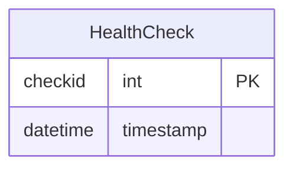

# WebApp - Health Check API

## Overview
This project is a simple web application designed to implement a health check API endpoint (`/healthz`). The application is built using Node.js, Express, and PostgreSQL, with Sequelize as the ORM framework. It adheres to the requirements for resilient database connectivity and proper HTTP response status codes.

---

## Features
- **Health Check API (`/healthz`)**: Provides the current status of the web application.
- **Database Connectivity**: Logs the health check events into a PostgreSQL database.
- **Resilience**: Handles database unavailability gracefully.
- **Caching Control**: Ensures no caching via HTTP headers.
- **HTTP Methods**: Restricts `/healthz` to GET requests only.
- **Payload Restriction**: Ensures no request payloads are allowed.

---

## Prerequisites
Ensure the following are installed on your system:
- **Node.js** (v16.x or later)
- **npm** (v8.x or later)
- **PostgreSQL** (v15.x or later)

---

## Setup Instructions

### Clone the Repository
```bash

git clone https://github.com/Lakshman-Siva/webapp-fork.git
cd webapp
```

### Install Dependencies
```bash
npm install
```

### Configure the Database
1. Update the `.env` file with your PostgreSQL credentials:
   ```env
   DATABASE_URL=postgres://<db_user>:<db_password>@127.0.0.1:5432/<db>
   DEV_DATABASE_URL=postgres://<db_user>:<db_password>@127.0.0.1:5432/<dev_db>
   TEST_DATABASE_URL=postgres://<db_user>:<db_password>@127.0.0.1:5432/<test_db>

   ```
2. Create the databases manually in PostgreSQL using the provided URLs. The application will automatically sync all the tables when started (no migrate or create command is required).

### Run the Application
```bash
npm start
```
The application will run at `http://localhost:8080`.


## API Endpoint

### **GET /healthz**
#### Description
- Performs a health check on the application.
- Logs the check to the database.

#### Response Codes
- **200**: Application is healthy.
- **503**: Database is unavailable.
- **400**: Non-empty request body provided.
- **405**: Method not allowed (for non-GET requests).

#### Example Usage
```bash
# Health Check Success
curl -X GET http://localhost:8080/healthz -i

# Simulating a Method Not Allowed Error
curl -X POST http://localhost:8080/healthz -i
```

## Testing
### Manual Testing
Use the following `curl` commands to test the application:
```bash
# Successful Health Check
curl -X GET http://localhost:8080/healthz -i

# Invalid Method
curl -X POST http://localhost:8080/healthz -i

# Non-Empty Body (Bad Request)
curl -X GET http://localhost:8080/healthz -d '{"key":"value"}' -i
```
### API collection
For testing purposes, a [Bruno Healthz Collection](https://github.com/Lakshman-Siva/webapp-fork/tree/main/docs/bruno/Healthz)
 is included in the docs folder. Use it to test the API endpoints.

---

## Database Model
Below is the database schema represented using Mermaid:




---

## License
This project is for educational purposes and is licensed under [MIT License](LICENSE).